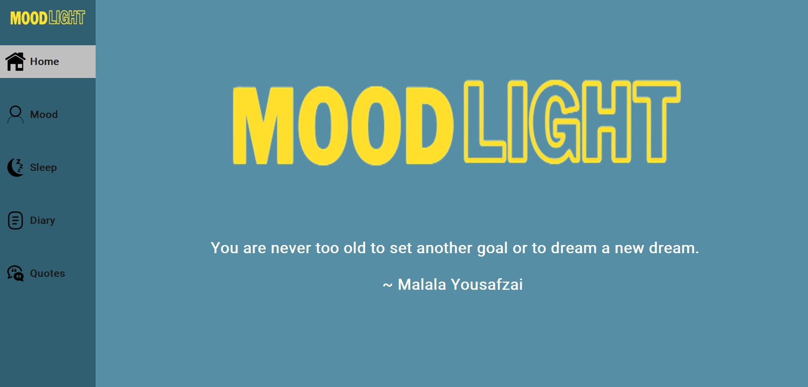
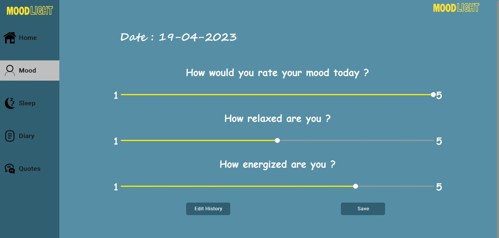
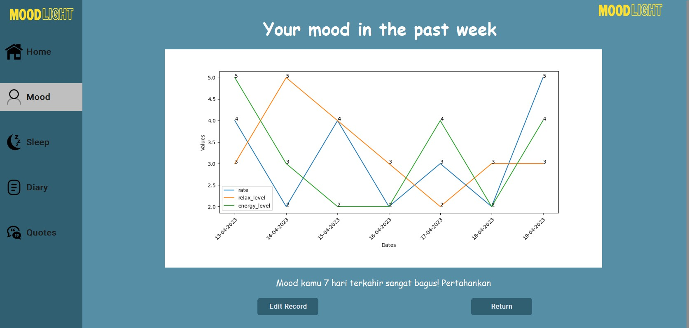
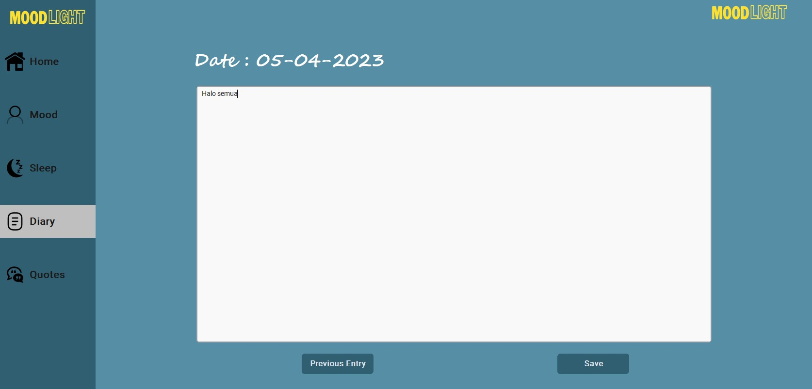
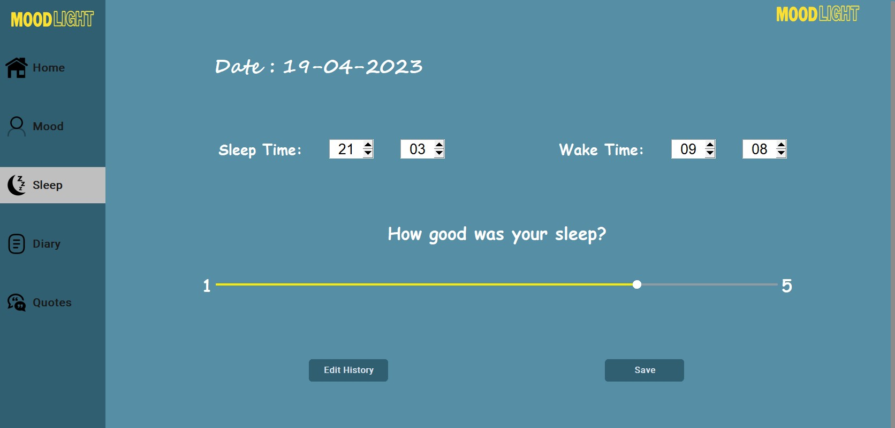
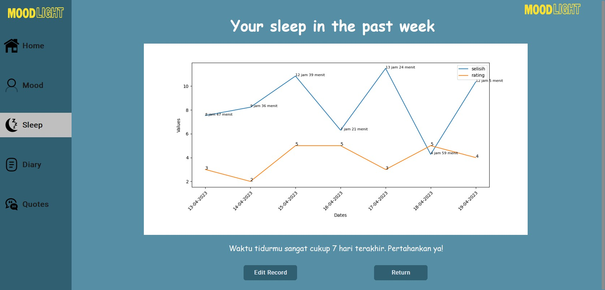
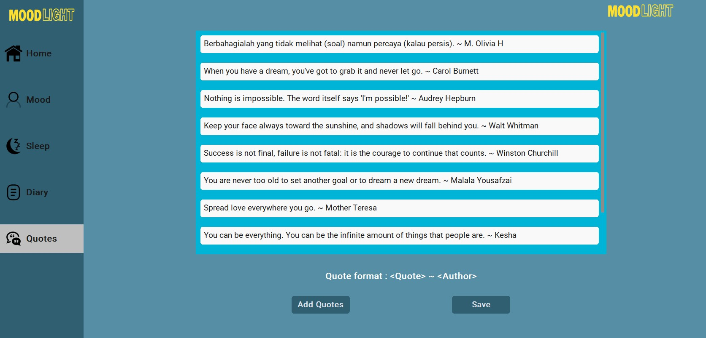

# MoodLight
> *Source Code* ini dibuat untuk memenuhi Tugas Besar Rekayasa Perangkat Lunak yaitu mengimplementasikan
> sebuah aplikasi berbasis GUI sesuai dengan spesifikasi yang diminta

## Daftar Isi
- [Author](#author)
- [Deskripsi Singkat](#deskripsi-singkat)
- [Sistematika File](#sistematika-file)
- [Requirements](#requirements)
- [Cara Menjalankan Program](#cara-menjalankan-program)
- [Tangkapan Layar Program](#tangkapan-layar-program)
- [Tabel Basis Data](#tabel-basis-data)
- [Daftar Perubahan](#daftar-perubahan)
- [Project Status](#project-status)

## Author
| NIM      | Nama                      |
| -------- | --------------------------|
| 13521062 | Go Dillon Audris          |
| 13521084 | Austin Gabriel Pardosi    |
| 13521108 | Michael Leon Putra Widhi  |
| 13521168 | Satria Octavianus Nababan |
| 13521172 | Nathan Tenka              |

## Deskripsi Singkat
Aplikasi *MoodLight*, yaitu aplikasi untuk melacak *mood* harian pengguna. Aplikasi ini hanya memiliki satu pengguna, sehingga tidak memerlukan fitur *register* dan *login*. Pengguna aplikasi ini dapat mencatat dan mengirim data nilai *mood* atau perasaan pengguna setiap harinya. Selain itu juga, pengguna dapat mencatat jurnal harian dan riwayat tidur. Pengguna dapat melihat riwayat tersebut yang sudah tercatat di hari sebelumnya, beserta jurnal harian, dan riwayat tidurnya (jika ada) dalam bentuk tabel, atau statistik atau grafik sederhana sebagai bonus.
Ketika membuka aplikasi, pengguna akan menerima kata-kata mutiara (*quotes*) secara *random*. Pengguna juga dapat menambahkan sendiri *quotes* yang diinginkan. *Quotes-quotes* yang ditambahkan sendiri oleh pengguna bisa diubah atau dihapus oleh pengguna. Aplikasi ini berbasis *desktop* sehingga lebih mudah untuk diakses secara personal.

## Sistematika File
```bash
.
├─── data
│   ├─── Diary.csv
│   ├─── Mood.csv
│   ├─── Quote.csv  
│   └─── Sleep.csv
├─── doc
├─── img
├─── src
│   ├─── Diary
│   │   ├─── DiaryModification.py
│   │   └─── DiaryModificationController.py
│   ├─── GUI
│   │   ├─── DiaryModificationPage.py
│   │   ├─── LandingPage.py
│   │   ├─── MoodModificationPage.py
│   │   ├─── QuotesModificationPage.py
│   │   └─── SleepTrackerPage.py
│   ├─── Mood
│   │   ├─── MoodModification.py
│   │   └─── MoodModificationController.py
│   ├─── Quote
│   │   ├─── QuoteModification.py
│   │   └─── QuoteModificationController.py
│   ├─── Sleep
│   │   ├─── SleepTrackerController.py
│   │   └─── SleepTrackerModification.py
│   ├─── Utility
│   │   ├─── Date.py
│   │   ├─── Statistics.py
│   │   └─── Time.py
|   └─── App.py
├─── .gitignore
└─── README.md
```

## Requirements
- matplotlib
- csv
- customtkinter
- tkinter
- pillow
- tkcalendar

## Cara Menjalankan Program
Program yang diimplementasikan merupakan sebuah *desktop application* berbasis GUI Tkinter milik bahasa pemrograman python. Berikut adalah prosedur menjalankannya.
1. Lakukan *clone repository* melalui terminal dengan *command* berikut
   ``` bash
    $ git clone https://gitlab.informatika.org/mikeleo03/IF2250-2023-K02-02-MoodLight.git
   ```
2. Lakukan pemindahan direktori ke `src` dengan *command* berikut
   ``` bash
    $ cd src
   ```
3. Unduh beberapa modul yang diperlukan dengan menjalankan *command* berikut
   ``` bash
    $ pip install [nama]
   ```
   dengan mengganti [nama] untuk setiap [*requirement*](#requirements) yang ada.
4. Selanjutnya jalankan program dengan menjalankan *command* berikut
   ``` bash
    $ python3 App.py
   ```
   Pastikan Python 3 versi terbaru sudah terpasang pada mesin eksekusi (Anda dapat mengecek versi Python 3 dengan menjalankan *command* ```python --version``` pada *command prompt*).
5. Jika proses berhasil, maka akan muncul sebuah tampilan aplikasi berbasis *desktop*. Selamat mengoperasikan aplikasi yang telah dibangun

## Tangkapan Layar Program
1. Tampilan program utama

*Gambar 1.* Tampilan program utama <br>
Modul terkait : GUI, Quote <br>
Implementer : 13521062, 13521084, 13521108
2. Tampilan fitur *Mood*

*Gambar 2.1.* Tampilan utama fitur *Mood* <br>
Modul terkait : GUI, Mood, Utility <br>
Implementer : 13521062, 13521084, 13521172

*Gambar 2.2.* Tampilan hasil statistik fitur *Mood* <br>
Modul terkait : GUI, Mood, Utility <br>
Implementer : 13521084, 13521108, 13521172
3. Cara mengoperasikan fitur *Diary*

*Gambar 3.* Tampilan utama fitur *Diary* <br>
Modul terkait : GUI, Diary <br>
Implementer : 13521168, 13521172
4. Cara mengoperasikan fitur *Sleep Tracker*

*Gambar 4.1.* Tampilan utama fitur *Sleep Tracker* <br>
Modul terkait : GUI, Sleep, Utility <br>
Implementer : 13521062

*Gambar 4.2.* Tampilan hasil statistik fitur *Sleep Tracker* <br>
Modul terkait : GUI, Sleep, Utility <br>
Implementer : 13521062, 13521108
5. Cara mengoperasikan fitur *Quote*

*Gambar 5.* Tampilan utama fitur modifikasi *Quote* <br>
Modul terkait : GUI, Quote <br>
Implementer : 13521084, 13521108, 13521172

## Tabel Basis Data
### Tabel Data *Diary* (Diary.csv)
| Atribut    | Tipe Data     | Keterangan |
| ---------- | --------------| -----------|
| tanggal    | date          | not null   |
| isiJournal | varchar(256)  |            |

### Tabel Data *Mood* (Mood.csv)
| Atribut       | Tipe Data     | Keterangan   |
| ------------- | --------------| -------------|
| tanggal       | date          | not null     |
| rate          | integer       | bernilai 1-5 |
| relax_level   | integer       | bernilai 1-5 |
| energy_level  | integer       | bernilai 1-5 |

### Tabel Data *Quote* (Quote.csv)
| Atribut  | Tipe Data     | Keterangan   |
| -------- | --------------| -------------|
| id       | integer       | not null     |
| author   | varchar(256)  |              |
| content  | varchar(256)  |              |

### Tabel Data *Sleep Tracker* (Sleep.csv)
| Atribut    | Tipe Data  | Keterangan    |
| ---------- | -----------| ------------- |
| tanggal    | date       | not null      |
| jamMulai   | time       | format 24 jam |
| jamSelesai | time       | format 24 jam |
| rating     | integer    | bernilai 1-5  |

## Daftar Perubahan
Berikut adalah daftar perubahan yang dirasa diperlukan setelah proses implementasi.
- [ ] Menambahkan kelas *Time* yang berfungsi untuk melakukan perhitungan durasi untuk ditampilkan pada statistik waktu tidur
- [ ] Menambahkan beberapa metode pada kelas-kelas *controller* yang berfungsi untuk memudahkan komunikasi objek lain dengan *controller*
- [ ] Tidak mengimplementasikan kelas InputDeterminer karena tidak diperlukan dalam implementasi aplikasi
- [ ] Menambahkan atribut-atribut tambahan serta metode tambahan pada seluruh kelas *boundary*. Atribut tambahan diperlukan untuk menyimpan *widget-widget* yang diperlukan. Sedangkan *method* tambahan dibutuhkan untuk menjaga *readability* dan *maintainability* kode

## Project Status
Status : *Completed*
ID | Kebutuhan Fungsional  | Ya | Tidak |
--|---|---|---|
F01 | P/L dapat mencatat dan menampilkan *mood* pengguna | ✓ |   |
F02 | P/L harus bisa menampilkan *positives quotes* ketika P/L diakses. | ✓ |   |
F03 | P/L dapat mencatat dan menampilkan jurnal harian pengguna. | ✓ |   |
F04 | P/L dapat mencatat, menyimpan, dan menunjukkan riwayat tidur pengguna. | ✓ |  |
F05 | P/L harus bisa menyimpan data  (*mood*, jurnal, riwayat tidur, *quotes*) pengguna secara *offline*. | ✓ |  |
F06 | P/L dapat memperlihatkan statistik data *mood* dan riwayat tidur berupa grafik sederhana. | ✓ |  |
F07 | P/L dapat mencatat data *mood* di hari-hari sebelumnya. | ✓ |  |
F08 | P/L harus menyediakan akses *edit* kepada pengguna. | ✓ |  |
F09 | P/L dapat menyajikan statistik lanjut yang *insightful* bagi pengguna. | ✓ |  |